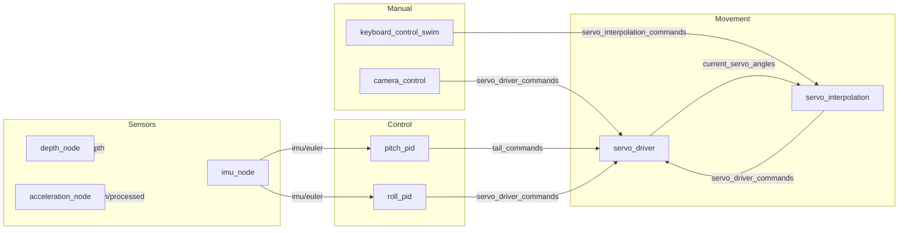

# Mobula AUV Quick Guide

This file summarizes how the main ROS2 nodes cooperate to move the Mobula AUV. It is based on the existing `README.md` but uses simpler language and a few diagrams.

## Overview

The AUV is controlled by a chain of ROS2 nodes. Sensors publish data, controllers react, and servo commands eventually move the vehicle.


```

This diagram shows the general data flow. Sensors feed the controllers, which publish servo commands. Optional manual nodes can inject movements.

## Node Effects

Below are short explanations and simple visuals for how each node affects the AUV.

### `pitch_pid` – adjust the tail for pitch/roll

```
     Tail down       ->     Nose up
      ____                 ____
_____/    \_____     ____/    \____
```

This controller reads `imu/euler` and uses PID logic to move the tail servos so the nose pitches up or down. When active (`tail_pid_active` topic) it publishes on `tail_commands`.

### `roll_pid` – stabilize the wings

```
  Wing down  ->  Vehicle rolls
  ____            ____
 /    \          /    \
```

It reads `imu/euler` and the desired roll angle. When active (`wing_pid_active` topic) it moves the wing servos via `servo_driver_commands`.

### `servo_interpolation` – smooth complex motions

```
High level cmds -> many tiny steps -> servo_driver
```

This node breaks large movements into small angles at ~70 Hz. It subscribes to `servo_interpolation_commands` and sends the smooth sequence to `servo_driver_commands`.

### `servo_driver` – talk to the hardware

```
Commands -> PCA9685 board -> servos move
```

As a lifecycle node it writes the final angles to each servo and reports state on topics like `current_servo_angles` and `servo_driver/heartbeat`.

### `imu_node` – orientation sensing

```
[IMU chip] -> orientation data -> imu/euler
```

Provides roll, pitch, yaw and health status. Other nodes rely on this information to know the vehicle's attitude.

### `depth_node` – water depth

```
Pressure sensor -> depth readings (/depth)
```

### `acceleration_node` – processed acceleration

```
IMU data -> remove gravity -> /acceleration/processed
```

### Manual control

- **keyboard_control_swim** lets an operator send target pitch/roll and movement sequences.
- **camera_control** can track arm gestures and publish servo commands directly.

## Launch Order

The launch file `mobula.launch.xml` starts nodes in this order:

1. `imu_node`
2. `servo_driver`
3. `servo_interpolation`
4. `pitch_pid`
5. `roll_pid`
6. `depth_node`
7. `acceleration_node`

`servo_driver` is delayed slightly after the IMU initializes. Depth and acceleration
sensors launch after the control loops.

---
Use this quick guide when you need a high-level picture of how the Mobula AUV ROS2 system fits together.
